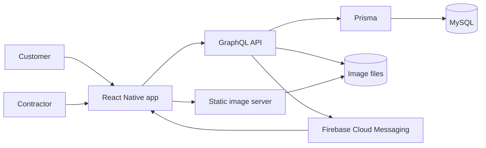

# Client Executor Mobile – CLEX

An archived React Native MVP for matching customers with contractors in printing, promotional products and outdoor advertising. Originally developed in 2022.

Customers publish orders and compare offers. Contractors browse orders by city and category, propose a price and receive notifications. Customers select a contractor, accept or reject the work and exchange reviews after completion.

## Features

- Separate customer and contractor navigation.
- Orders with photos, quantities, categories, city filters and urgency.
- Offers, contractor selection, cancellation and completion.
- Profiles, avatars and mutual ratings.
- Russian and English interfaces; light and dark themes.
- Firebase Cloud Messaging; local session storage with MMKV.

## Architecture



The backend is maintained in [client-executor-server](https://github.com/proxymades/client-executor-server). Place `client-executor-mobile` and `client-executor-server` next to each other for local development; the backend can then validate all mobile GraphQL documents with `npm run check`.

## Stack and prerequisites

React Native 0.68.2, React 17, Apollo Client 3.6, React Navigation 6 and React Native Firebase 14.11. This is a legacy codebase, not a current React Native starter.

JavaScript checks and Metro bundles have been verified with Node.js 22.21.1 and npm 10.9.4. Native iOS compilation with the installed Xcode/iOS 26.2 SDK failed in Yoga.cpp:2232 (`-Werror,-Wbitwise-instead-of-logical`). A separate native toolchain migration is required for that environment. Android native compilation has not been verified. The original Android configuration targets SDK 31; iOS uses the original CocoaPods dependencies.

## Local setup

1. Start the companion GraphQL server on port 4000 and image server on port 5001. See its README for MySQL setup and optional demo accounts.
2. Install dependencies:

   ```sh
   npm ci
   npm run configure
   ```

   `configure` creates an ignored `config/local.json` if it is missing. It never overwrites an existing configuration.

3. Configure your own Firebase application for bundle/application ID `kz.clex`:
   - Android: download `google-services.json` to `android/app/`.
   - iOS: download `GoogleService-Info.plist`, add it to the `clex` target in Xcode and initialize Firebase in `AppDelegate` according to React Native Firebase 14 setup instructions. iOS Firebase setup and native push delivery remain unverified in this archive.
   - These project-specific files are excluded from Git. Server push delivery can be disabled independently with `FIREBASE_ENABLED=false`.
4. For a physical device, copy `config/local.example.json` to `config/local.json` and replace the example IP with the server computer's LAN address. For emulators, leave the file as `{}`: Android uses `10.0.2.2`, iOS uses `localhost`.
5. Start Metro with `npm start`; run `npm run android` or configure CocoaPods and run `npm run ios` with a compatible native toolchain.

For physical iOS devices, use HTTPS endpoints; the original ATS exception allows HTTP only for localhost. Android's debug manifest permits local HTTP. Release builds need HTTPS and their own signing configuration; the archived release configuration uses the debug keystore.

Endpoint configuration lives in `config/default.json` with local overrides in `config/local.json`. It contains public URLs only, never server credentials.

## Checks

```sh
npm run check
npm test -- --runInBand --watchman=false
npx react-native bundle --platform android --dev false --entry-file index.js --bundle-output /tmp/clex-android.bundle --assets-dest /tmp/clex-android-assets
```

`check` parses the application, resolves local imports and validates endpoint URLs. Seven tests cover malformed/expired tokens, login state, logout, primary contractor actions and recovery from failed offers. Metro bundling verifies JavaScript transformation and dependency resolution; it does not prove native compilation or device behavior.

The server requires expiring JWTs. Sessions last seven days; old tokens without expiry require signing in again. Firebase token registration failures do not prevent login.

## Screenshots and validation status

Real screenshots are pending a native device or simulator run. See [the capture checklist](docs/screenshots/README.md); no simulated screenshots are presented as native output.

Android and iOS JavaScript bundles, session tests and all 44 GraphQL documents have been checked. Native builds, camera/photo permissions, FCM delivery and the complete two-account flow still require device validation. Password recovery, phone ownership verification, account deletion and several settings actions are not implemented. API rate limits and a production operations setup are outside this archive's scope.

## Publication

See [PUBLISHING.md](PUBLISHING.md) before making the existing repository public. The local history was cleaned before publication; keep reviewing current files and historical commits separately.

## License

[ISC](LICENSE). CLEX branding is retained as the original project name.
